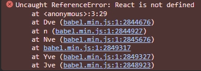

# (ReactやVueは使わず)JSXをトランスパイルして自力でDOMへ変換するサンプルプログラム

## はじめに

(ReactやVueは使わず)JSXをコンパイルしてDOMを生成する解説が見つからなかったので、サンプルプログラムを作成しました。


### このサンプルでやりたいこと

* jQueryでjsxを直接を追加できるようにする
```javascript
// jQueryで追加する場合はこんなイメージ
 $('#app').append('<a href="https://yahoo.co.jp"><button>Yahooへ</button></a>');
```

```javascript
// jsxで追加する場合のイメージ
 $('#app').append(<a href="https://yahoo.co.jp"><button>Yahooへ</button></a>);
```

### 前提知識

* jsxとは

JSX（JavaScript XML）は、JavaScriptの構文拡張で、JavaScriptファイル内にHTMLのようなコードを記述できるようにするもの。

例えば、Reactであれば、`React.createElement()`が入れ子になった`式`に変換されます。
`React.createElement()`がDOMを生成する関数（というイメージ）です。


* jsx変換前
```javascript
const dom = <a href="https://yahoo.co.jp"><button>Yahooへ</button></a>;
console.log(dom)
```

* jsx変換後(babelのデフォルト)
```javascript
var dom = /*#__PURE__*/React.createElement("a", {href: "https://yahoo.co.jp"},
            /*#__PURE__*/React.createElement("button", null, "Yahooへ")
            );
console.log(dom);
```
※1つめの引数が`タグ名`、2つ目が`属性`、3つ目が`子要素`

今回はReactを利用せずDOMを生成するため、下記2点の実装を行います
  1. jsxのトランスパイル(の設定)
  1. React.createElement()に代わる、DOM生成関数を作成

## ①jsxのトランスパイル


jsxをトランスパイルするためには[babel](https://babeljs.io/)や[TypeScript](https://www.typescriptlang.org/)を利用します。
今回はできるだけ簡単にするため、[babel/standalone](https://babeljs.io/docs/en/babel-standalone)を利用して、1つのHTMLファイルのみで実行できるようにします。

* webサーバー不要(htmlファイルをダブルクリックするだけで実行可能)
* TypeScriptやtsxも実行可能（別の機会にでも）


### テンプレートhtml

* bableを使いトランスパイルまで行います
* DOM生成関数がないため、実行時エラーになります

```html
<!DOCTYPE html>
<head>
  <meta charset="utf-8">
  <title>babel/standaloneでjsxをトランスパイルするテンプレート</title>
  <script src="https://unpkg.com/@babel/standalone/babel.min.js"></script>
  <script>
    // babelでjsxをトランスパイル可能にするため、プライグイン[transform-react-jsx]を
    // 読み込んだプリセット「jsx」を登録します
    Babel.registerPreset('jsx', {
      presets: [
        [Babel.availablePresets['env']]
      ],
      plugins: [
          [Babel.availablePlugins['transform-react-jsx']]
      ],
    });
  </script>

</head>
<body>
  <div id="app"></div>
  <!--
    type="text/babel" ⇒ babelにトランスパイル対象であることを伝える(ブラウザからは無視されます)
    data-presets="jsx" ⇒ 上記で登録したプリセットでトランスパイルします
   -->
  <script type="text/babel" data-presets="jsx" >
    const elements = <a href="https://yahoo.co.jp"><button>Yahooへ</button></a>;
    document.getElementById('app').appendChild(elements);
  </script>
</body>
</html>

```

※テンプレート.htmlを実行すると実行時エラーが発生します。次の章で修正します。




## ②jsxからDOMに変換する
①で発生したエラーは、Babelのデフォルト設定がReact用になっているため発生します。

②では設定を変更して、jsxが自作のDOM生成関数を呼び出すようにしてみます

 1. Babelの設定を変更して、jsxの変換関数を変更する`React.createElement() ⇒ h()`
 1. DOMを生成する関数`h(tagName, props,  ...children)`を作る
 1. jsxからDOMオブジェクトが生成されることを確認する


### ②-1 babelの設定を変更して、jsx変換後の関数を`h()`にする

jsxをbabelでトランスパイルすると、標準では`React.createElement()`の呼び出しに変換されます。
  ⇒ 今回はReactを使わずに、独自関数を呼び出すようにトランスパイルオプションを変更します


* トランスパイルオプションの変更点
  * `pragma:'h'`：jsxを変換した後の`関数名`を`h()`に変更
  * `pragmaFrag: 'div'` ：フラグメント`<> </>`を`<div>`扱いにする

設定変更箇所(一部抜粋)
```html
  <script src="https://unpkg.com/@babel/standalone/babel.min.js"></script>
  <script>
    Babel.registerPreset('jsx', {
      presets: [
        [Babel.availablePresets['env']]
      ],
      plugins: [
          [
            Babel.availablePlugins['transform-react-jsx'],
            {pragma:'h', pragmaFrag: '"div"'},　　// 追加
          ]
      ],
    });
  </script>
```


* jsx変換前
```javascript
const dom = <a href="https://yahoo.co.jp"><button>Yahooへ</button></a>;
console.log(dom)
```

* jsx変換後(babelのデフォルト)
```javascript
var dom = /*#__PURE__*/React.createElement("a", {href: "https://yahoo.co.jp"},
            /*#__PURE__*/React.createElement("button", null, "Yahooへ")
            );
console.log(dom);
```

* 変換後(babel設定変更後)
```javascript
var dom = /*#__PURE__*/h("a", {href: "https://yahoo.co.jp"},
            /*#__PURE__*/h("button", null, "Yahooへ")
            );
console.log(dom);
```

これで、Reactの世界とお別れしました。次にDOMを生成する関数`h()`を作成していきます。

※`h()`という関数名は、[hyperscript](https://github.com/hyperhype/hyperscript)から借用


### ②-2 DOMを生成する関数`h(tagName, props,  ...children)`を作る

引数(`タグ`, `属性`, `子要素`)を渡すと、タグを作って返してくれる関数を作ります。

下記のようなイメージの関数です
```js
h('div',{id: 'divid'}, 'text')
//<div id="divid">text</div>
```
DOMに変換する関数の仕様は[React.createElement()](https://beta.reactjs.org/reference/react/createElement)を参考にしました
* h(tag, props, ...children)
  * tag: タグ名
  * props: タグの属性(ex. {id: 'divid'})
  * children: 子要素(文字列、もしくは子タグ)

* jsxからDOMを生成する際、下記ができるようにする
  * classやidなど属性を反映する
  * styleの指定ができる
  * clickなどのイベントが動作する

DOM生成関数

```javascript
function h(tag, props, ...children) {
  // elementを作成
  const elm = document.createElement(tag);
  // 属性を追加
  for (const prop in props) {
    if (prop === 'style') {
      // styleの追加
      for (const s in props[prop]) {
        elm.style[s] = props[prop][s];
      }
    } else if (/^on\w+/.test(prop)) {
      // イベントハンドラの追加
      elm.addEventListener(prop.substring(2), props[prop], false);
    } else {
      // 上記以外の属性を追加
      elm.setAttribute(prop, props[prop]);
    }
  }

  // 子要素の追加
  if (Array.isArray(children)) {
    flatten = children.flat();
    for (const child of flatten) {
      if (typeof child === 'object') {
        // Nodeをそのまま追加(深さ優先で子側が生成され、それが渡される)
        elm.appendChild(child);
      } else {
        // 文字列の場合、TextNodeとして追加
        elm.appendChild(document.createTextNode(child));
      }
    }
  }
  return elm;
}
```

変換サンプル
``` html
・h('div')
   ⇒ <div></div>
・h('div',null, 'text')
   ⇒ <div>text</div>
・h('div',{id: 'divid'}, 'text')
   ⇒ <div id="divid">text</div>
・h('div',{style: {backgroundColor: 'red'}}, 'text')
   ⇒ <div style="background-color: red;">text</div>
・h('div',{style: {'background-color': 'red'}}, 'text', h('span', {}, 'span tag'))
   ⇒ <div style="background-color: red;">text<span>span tag</span></div>
```

こんな感じで、JSXがDOMに置き換わったことが確認できました(step2-2.html)。


---


### ②-3 jsxからDOMを生成(イベントハンドラのテスト)

ここからは少々応用編です。jsxでスタイルの指定と、イベントハンドラが動くことを確認します。

```jsx
    $('#app').append(
      <div style={{ backgroundColor: '#ccf' }}>
        <h2 style={{"font-style":"italic"}}>jsxから自作関数でDOMに変換するサンプル</h2>
        <div id="div1" className="classname1">
          <input type="text" id="text1" value="text1" />
          <button onclick={() => alert(document.getElementById('text1').value)}>
            show textbox value
          </button>
        </div>
      </div>
    );
```


下記[ソース(step2-3.html)](./step2-3.html)をブラウザで開くと、jsxからDOMに変換されて表示されます。


* ブラウザのDevToolで、DOMが想定した通りに生成(属性やstyle)されていることが確認できました


* ボタンのclickイベント(テキストボックスに入力した内容をalert()で表示)も動作しています


ソース全体([step2-3.html](./step2-3.html))
```html
<!DOCTYPE html>
<head>
  <meta charset="utf-8">
  <title>jsxを自力でDOM化してみよう</title>
  <script src="https://unpkg.com/@babel/standalone/babel.min.js"></script>
  <script src="https://code.jquery.com/jquery-3.7.1.min.js" integrity="sha256-/JqT3SQfawRcv/BIHPThkBvs0OEvtFFmqPF/lYI/Cxo=" crossorigin="anonymous"></script>
  <script>
    Babel.registerPreset('jsx', {
      presets: [
        [Babel.availablePresets['env']]
      ],
      plugins: [
          [
            Babel.availablePlugins['transform-react-jsx'],
            {pragma:'h', pragmaFrag: '"div"'},
          ]
      ],
    });
  </script>
  <script>
    /**
     * DOMに変換する関数
     * ・React.createElement()や、hyperscript()のようにDOMを生成する関数
     *   tag: タグ名
     *   props: タグの属性
     *   children: 子要素
     * 変換サンプル
     * ・h('div')
     *    ⇒ <div></div>
     * ・h('div',null, 'text')
     *    ⇒ <div>text</div>
     */
     function h(tag, props, ...children) {
      // elementを作成
      const elm = document.createElement(tag);
      // 属性を追加
      for (const prop in props) {
        if (prop === 'style') {
          // styleの追加
          for (const s in props[prop]) {
            elm.style[s] = props[prop][s];
          }
        } else if (/^on\w+/.test(prop)) {
          // イベントハンドラの追加
          elm.addEventListener(prop.substring(2), props[prop], false);
        } else {
          // 上記以外の属性を追加
          elm.setAttribute(prop, props[prop]);
        }
      }

      // 子要素の追加
      if (Array.isArray(children)) {
        flatten = children.flat();
        for (const child of flatten) {
          if (typeof child === 'object') {
            // Nodeをそのまま追加(深さ優先で子側が生成され、それが渡される)
            elm.appendChild(child);
          } else {
            // 文字列の場合、TextNodeとして追加
            elm.appendChild(document.createTextNode(child));
          }
        }
      }
      return elm;
    }
  </script>
</head>
<body>
  <div id="app"></div>
  <script type="text/babel" data-presets="jsx" >
    $('#app').append(
      <div style={{ backgroundColor: '#ccf' }}>
        <h2 style={{"font-style":"italic"}}>jsxから自作関数でDOMに変換するサンプル</h2>
        <div id="div1" className="classname1">
          <input type="text" id="text1" value="text1" />
          <button onclick={() => alert(document.getElementById('text1').value)}>
            show textbox value
          </button>
        </div>
      </div>
    );
  </script>
</body>
</html>
```


